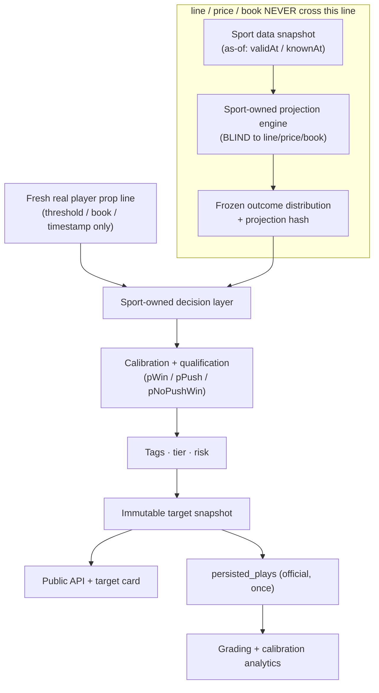

# PR0 — Current-State Trace (NBA + NFL Pregame Targets)

**Status:** PR0 discovery. Non-production-change baseline. No production file was
modified to produce this document.
**Branch:** `claude/nba-nfl-pregame-targets-reka2f`
**Goal of the program:** recreate the MLB pregame *decision experience* (The
Plate / The Mound) for **NBA** ("The Court") and **NFL** ("The Huddle") using
sport-native probabilistic engines — reusing MLB's UX and infrastructure
*patterns*, never its engine math (sport isolation is a first-class repo
invariant; see `docs/sport-isolation-audit.md`, `CLAUDE.md` §3.1).

This trace is the map an implementer must confirm before touching code. All
paths were verified against repo head.

---

## 1. MLB Plate ("The Plate") — the batter-facing pregame reference

| Layer | Path · entry point |
| --- | --- |
| Build | `server/mlb/pregamePowerRadar/buildPregamePowerRadar.ts` → `buildPregamePowerRadar()` |
| Scoring / tier | `.../scoring.ts` → `composePregameScore`, `classifyTier`, `tierFromScore`, `COMPONENT_WEIGHTS`, `PUBLISH_MIN_SCORE=6.0` |
| Tags | `.../marketTagger.ts` → `computeMarketTags`, `marketSetupLabel` (`Elite/Strong/Solid/Watch`) |
| Publication authority | `.../modelVersions/platePublicationDecision.ts` → `decidePlatePublication`, `isPubliclyEligibleTier` |
| Model versions | `.../modelVersions/` → `plateChampionJul20.ts` (`plate_jul20_restored_v1`, hard-coded champion), `plateChallengerCurrent.ts` (shadow), `plateShadowFlags.ts` (fail-closed flag), `frozenPlateInput.ts` (immutable hashed DTO) |
| Component 6 | `.../nearHrRecentForm.ts` → `computeNearHrRecentForm` |
| Persistence | `.../pregamePersistence.ts` → `installPregamePersistence`, `loadPregameSnapshotFromDb`; storage `upsertPregamePowerRadarSignal`, `recordPregamePowerBuild` |
| Graded-state carry | `.../gradedStateCarry.ts` |
| Grading | `.../shadowOutcomes.ts` → `gradePregameOutcomes`, `getPregameCalibrationRecord` |
| Attribution | `.../winAttribution.ts` → `deriveWinAttribution`, `buildPregameRadarWinItem`, `buildDailyPregameWins` |
| Public stats | `.../calibrationStats.ts` → `buildPublicStats`, `buildCalibrationStats` |
| Service / store / diag | `pregamePowerRadarService.ts`, `pregamePowerRadarStore.ts`, `diagnostics.ts` (`buildResponse`), `oddsDisplay.ts` (display-only) |

### 1a. Delta since baseline (9 commits `8c818ec..078b320`, rebased in)

The branch was rebased onto `origin/main` after PR0's first push. Those 9 commits
added a **read-only ISO (isolated power) classification + reliability-gated
tagging** layer to the Plate. Trace updates:

- **New pure modules** (`server/mlb/pregamePowerRadar/`):
  - `isoAssessment.ts` → `assessIso`, `isoFromRateStats`, `isoFromCountingStats`,
    `resolveIsoTagDisplay`; `IsoTier = ELITE|STRONG|AVERAGE|WEAK|UNAVAILABLE`.
    Reliability-shrunk ISO (stabilization AB, min-sample gates) — the
    quantitative basis for the power tag.
  - `isoAssessmentConfig.ts` → `ISO_ASSESSMENT_VERSION="iso_assessment_v1"`,
    thresholds (`ISO_ELITE_MIN=0.24`, `ISO_STRONG_MIN=0.20`, …), sample gates.
  - `isoDistributionAudit.ts` → `buildIsoDistributionReport`, `buildIsoSlateAudit`,
    `recordAndLogIsoSlateAudit` — **read-only** prevalence guardrail
    (`ISO_ELITE_PREVALENCE_WARN=0.25`, `TAG_PREVALENCE_WARN=0.50`) that warns on
    tag/tier inflation. Runs at the **assessment boundary** in the build layer,
    **not** in `buildResponse` (which only sees surviving signals).
  - Tests: `isoAssessment.test.ts` (35), `isoTagSelection.test.ts` (42),
    `plateChampionSlateInvariance.test.ts` (39, champion-invariance + read-only
    population gate).
- **Contract change (additive)** — `types.ts` `PowerDriver` gained
  `displayEligible?: boolean` (server-stamped chip display gate; a driver may
  still *count* as evidence when `false`) and `tier?: string` (e.g. the ISO
  tier). **No new driver KEY**, so the champion driver-universe / hygiene
  contract is unchanged.
- **Build wiring** — `buildPregamePowerRadar.ts` runs the ISO assessment and
  feeds `recordAndLogIsoSlateAudit`; `batterPowerProfile.ts` supplies ISO inputs.
- **`diagnostics.ts`** — behavior unchanged; a comment documents *why* the ISO
  audit lives in the build layer, not `buildResponse`.
- **Client** — `PregamePowerRadar.tsx` honors `displayEligible` (hides gated
  chips) and renders the ISO `tier` verbatim; still no client-side scoring.

This delta **does not** change `score10`, tier gates, publication, persistence,
or grading — it is an additive classification/telemetry layer. The PR0 golden
fixtures capture the affected serialized (`buildResponse`) and mapping
(`signalToRow`/`rowToSignal`) boundaries, which pass unchanged.

## 2. MLB Mound ("The Mound") — the pitcher-facing pregame reference

| Layer | Path · entry point |
| --- | --- |
| Build | `server/mlb/pregame/mound/buildMlbMoundRadar.ts` → `buildMlbMoundRadar()` |
| Scoring / tier | `.../scoring.ts` → `composeMoundScore`, `classifyMoundTier`, `MOUND_PUBLISH_MIN_SCORE=5.5` |
| Direction | `.../moundDirection.ts` → `computeMoundDirection` (`fade`/`follow`/`null`, server-stamped once at build) |
| Tags | `.../marketTagger.ts` → `computeMarketTags`, `platoonKFitLabel` (K Skill / K Matchup, display-only) |
| Evaluation freeze | `.../evaluationSnapshot.ts` → `buildMoundEvaluationSnapshot` (freezes score/tier/`postedLine`/baseline), `applyMoundEvaluationSnapshots` |
| Graded-state carry | `.../moundGradedStateCarry.ts` → `carryForwardMoundGradedState` |
| Outcome attribution | `.../moundOutcomeAttribution.ts` → `resolveMoundSettlementDirection`, `deriveMoundOutcome`, `deriveMoundMarketOutcome`, `deriveModelOutcomeLabel`, `buildMoundSettlementView`, `resolveMoundSettlementLane` |
| Grading | `.../moundShadowOutcomes.ts` → `gradeMoundOutcomes`, `getMoundCalibrationRecord` |
| Persistence | `.../moundPersistence.ts` → `signalToRow`, `rowToSignal`, `loadMoundSnapshotFromDb`, `installMoundPersistence`; storage `upsertMlbMoundRadarSignal`, `recordMlbMoundRadarBuild` |
| Service / store / diag | `mlbMoundRadarService.ts` (`getMoundRadarSnapshot`), `mlbMoundRadarStore.ts`, `diagnostics.ts` (`buildMoundResponse`) |
| V2 shadow (research) | `.../v2/` — distributional engine, zero production import edges (`CLAUDE.md` §3.9) |

## 3. API surface (`server/routes.ts`)

Public routes gated by `requireMLBAccess`; admin by `requireAdmin`.

- Plate: `GET /api/mlb/pregame-power-radar`, `.../:gameId`, admin `.../debug`,
  `POST .../backfill-visibility`
- Hub: `GET /api/mlb/pregame-hub` (unified Plate+Mound; `buildPregameHubResponse`)
- Mound: `GET /api/mlb/mound-power-radar`, `.../all-starters` (client board source),
  admin `.../debug`
- Cash log: `GET /api/mlb/daily-cashed-log` (`requireAuth`)
- Stats: `registerPregameRadarStatsRoutes(...)`

**Shared transport contracts** (the reusable patterns for a new sport contract):
`shared/mlbPregameHub.ts` (`MlbPregameHubResponse`, `PregameRadarTarget`,
`PregameRadarView`, `PregameRadarTargetTracking`), `shared/pregameRadarWin.ts`,
`shared/moundRadarWin.ts`, `shared/mlbRecommendationEpisode.ts` (frozen-episode
template), `shared/mlbOddsProvenance.ts`.

## 4. Client surface (`client/src/`)

`pages/mlb-live.tsx` (mounts `<PregameHub>` when `activeSubTab==="pregame_power"`)
→ `components/mlb/pregame/PregameHub.tsx` (two-pill "The Plate"/"The Mound"
switcher) → `components/mlb/PregamePowerRadar.tsx` / `MoundPowerRadar.tsx`
(boards) → `components/mlb/PregameWinCard.tsx` / `MoundWinCard.tsx`.

Both boards render server-stamped `score10`/`tier`/`tags`/`drivers` **verbatim**
— an explicit invariant in the component headers ("NO client-side scoring or
tier derivation"). Each holds a `TIER_STYLE` map + Flame/Zap/Target icon,
filter chips, and an honest empty state (`empty-pregame-power`,
`empty-mound-radar`).

## 5. NBA existing path (engine exists; pregame targets do NOT)

| Concern | Path · entry point |
| --- | --- |
| Probability | `server/nba/probabilityEngine.ts` → `computeProbability` (`phi` Abramowitz-Stegun Normal CDF; 0.45/0.35/0.20 recent/season/role blend; combo covariance; fragility) |
| Calibration v2 | `server/nba/probabilityFinalizer.ts` → `finalizeNbaProbability` (documents **80–100% overconfidence: 28.6% actual vs 60.1%**; `HARD_CEILING_PP=82`; **never raises**) |
| Archetypes / family / conflict | `archetypes.ts`, `marketFamily.ts`, `conflictSuppression.ts`, `marketTaxonomy.ts`, `directionalBias.ts` |
| Engine wrapper | `server/engines/nba/index.ts` → `processNBAEngine`; `types.ts` (`NBAPlay`, strict/fallback rules), `validation.ts` |
| Minutes (live) | `server/minutesModel.ts` → `calculateRemainingMinutes` |
| Minutes (pregame) | `server/services/minutesProjectionService.ts` |
| Rotation history | `server/services/nbaRotationHistoryService.ts` → `getPlayoffRotationProfile` (has `dataSource` provenance) |
| Stats access | `server/services/nbaStatsService.ts` → `getPlayerGameLogs`, `getTeamGameLogs` |
| Route production | `server/routes.ts` ~6274–6800 (`processNBAEngine` call), `isNbaHalftimeWindow` @~6998, `deriveSecondHalfLine` @~7041 |
| Calibration audit | `server/scripts/nbaCalibrationAudit.ts` |

**Key point:** the current NBA path is **live/halftime**, static-blend + Normal
CDF + shrink-to-0.5. It is *not* a pregame as-of Bayesian/Monte-Carlo engine. See
`PR0-conflicts-and-migration.md` §1.

## 6. Canonical infrastructure to REUSE (never duplicate)

| Concern | Path |
| --- | --- |
| Official ledger | `persistedPlays` (`shared/schema.ts` ~410–514); no `surface`/snapshot-id provenance columns yet |
| Ledger gateway | `server/storage.ts` → `recordPlay` (dedup on `duplicateGuard`), `settlePlay` |
| Live-signal funnel | `server/services/playTracker.ts` → `trackPlay` (builds `duplicateGuard` w/ `todayET`) |
| Grader | `server/services/gradePersistedPlays.ts` (`MLB_STAT_KEY_MAP`, calls `settlePlay`; imports NBA `recordResult`) |
| Access resolver | `server/utils/access.ts` → `resolveAccess` (tier `all`=NBA+NCAAB, `elite`=+MLB); `server/auth.ts` → `requireTier`, `requireMLBAccess`, `requireAdmin` |
| Tier mapping | `server/utils/resolveTier.ts`, `server/billing/planMap.ts` |
| Odds (raw + normalize) | `server/oddsService.ts` (`PROP_BOOKMAKERS` NBA list, `getGameLines` spreads/totals, `normalizeOdds`) |
| Odds (cache, sport-aware) | `server/odds/oddsConfig.ts` (`PREFERRED_BOOKS_BY_SPORT`, `FRESHNESS_BY_SPORT`), `oddsCache.ts`, `oddsSnapshot.ts` |
| Analytics (read-only) | `server/analytics/analyticsEvent.ts` (`recordAnalyticsEvent`, append-only ring buffer, MLB-only today), `eventEmitters.ts` |
| Migration bootstrap | `server/dbMigrations/*Persistence.ts` (idempotent `IF NOT EXISTS` + self-heal `ADD COLUMN IF NOT EXISTS`); template `pregameRadarPersistence.ts`; wired in `server/index.ts` ~230–272 |
| Feature-flag pattern | `*Flags.ts` next to the engine, fail-closed env parse (`plateShadowFlags.ts`) |

---

## 7. Target data-flow (spec) with the enforced blindness boundary

The projection engine is structurally blind to `D`. In PR2+ this boundary is
enforced by **input types + tests** (changing line/price/book must leave the
projection hash bit-identical), not comments — see the release gates in the
build spec §16 and the invariance tests in `server/pregameTargets/` (PR0 froze
the current MLB/NBA pure-function baselines those tests will extend).
